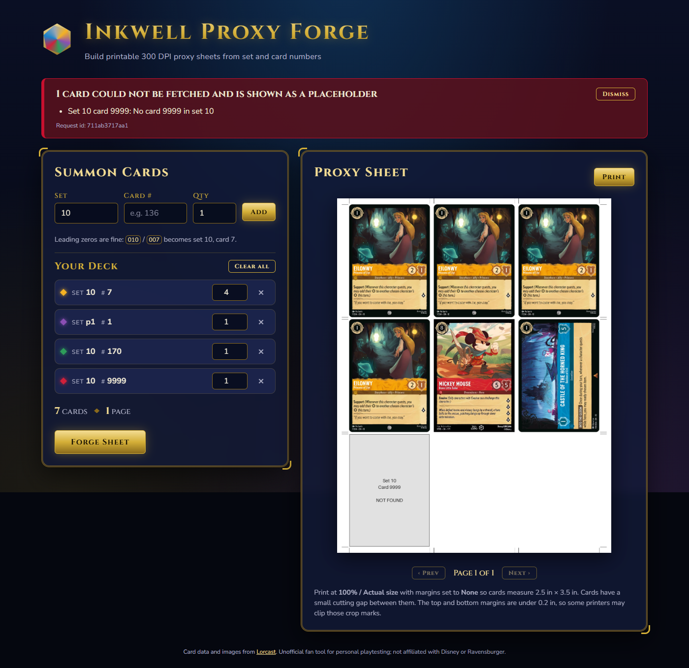
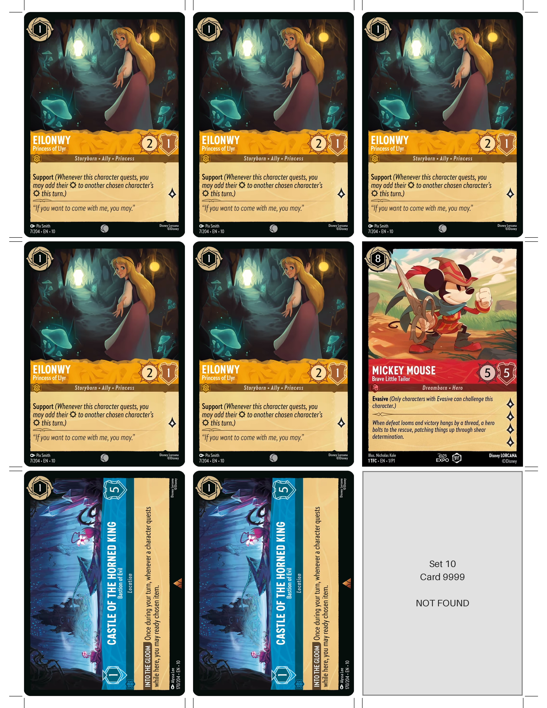

# Inkwell Proxy Forge

A small local web app that builds printable **Disney Lorcana proxy sheets**. You list cards by set number, card number, and quantity; a FastAPI server fetches each card's art from the [Lorcast API](https://lorcast.com/docs/api/cards) and returns **300 DPI US Letter pages** with a print button.



## Features

- Enter cards as set / card number / quantity. Leading zeros are fine (`010` / `007` becomes set 10, card 7), and set codes are matched case-insensitively (`p1` finds `P1`).
- Duplicate entries are merged and their quantities summed.
- The server fetches the **large** image for each unique card, with at least **75 ms between every request** to Lorcast (card lookups, image downloads, and retries).
- Pages are **2550 x 3300 px (8.5 x 11 in at 300 DPI)** with cards at true size, **2.5 x 3.5 in**, in a 3 x 3 grid.
- A small cutting gap separates the cards (1/8 in between columns, 1/16 in between rows), with crop marks at every card edge.
- Cards that can't be fetched become labeled placeholders, so the rest of the sheet still prints, and the UI lists what went wrong.
- Dark, Lorcana-inspired interface in plain HTML, CSS, and JavaScript (no build step).



## Requirements

- Python 3.12+
- A modern browser (Edge, Chrome, Firefox, Safari)
- Internet access to reach `api.lorcast.com` and `cards.lorcast.io`

Lorcast serves card art as AVIF. Pillow 11.2 and newer decodes AVIF natively, so no extra image plugin is needed.

## Setup

```powershell
python -m venv .venv
.\.venv\Scripts\python -m pip install -r requirements.txt
```

On macOS or Linux, use `.venv/bin/python` instead of `.\.venv\Scripts\python`.

## Run

```powershell
.\.venv\Scripts\python -m uvicorn server.main:app --port 8765
```

Open [http://127.0.0.1:8765](http://127.0.0.1:8765). Add `--reload` while developing.

## Using it

1. Type a set number, card number, and quantity, then press **Add** (or Enter). The set stays filled in, so you can add several cards from the same set quickly.
2. Adjust quantities or remove cards in the list. The running total shows cards and pages.
3. Press **Forge Sheet**. The pages appear in the viewer when they're ready.
4. Press **Print**.

### Printing tips

- Print at **100% / Actual size** with margins set to **None**, or the cards won't measure 2.5 x 3.5 in.
- The top and bottom page margins are just under 0.2 in. Some printers can't print that close to the edge and may clip those crop marks; the cards themselves are unaffected on most printers.
- Lorcast's large image is 674 x 940 px, so the art is scaled up about 1.1x to fill each card. The page is 300 DPI, but the art is slightly softer than native 300 DPI.

## Configuration

Every tunable value is a named constant in [`server/config.py`](server/config.py), including:

| Setting | Default | Purpose |
| --- | --- | --- |
| `REQUEST_DELAY_SECONDS` | `0.075` | Minimum spacing between requests to Lorcast |
| `CARD_GAP_X_IN` / `CARD_GAP_Y_IN` | `0.125` / `0.0625` | Cutting gap between columns / rows |
| `MAX_QUANTITY` | `20` | Copies allowed per card |
| `MAX_ENTRIES_PER_REQUEST` | `60` | Different cards per sheet |
| `MAX_TOTAL_CARDS` | `90` | Total cards per sheet (10 pages) |
| `MAX_RETRIES` | `3` | Retries for timeouts, connection errors, HTTP 429 and 5xx |

The server checks at startup that the card grid (including gaps) fits on the page. The browser loads its limits from the server, so the UI and server always enforce the same rules.

Set the `LOG_LEVEL` environment variable (for example `DEBUG`) to see every Lorcast request, its status and timing, and rate-limiter waits. Every log line includes a request id, which is also returned in the `X-Request-ID` header and shown in the UI's error panel.

## API

| Method | Route | Description |
| --- | --- | --- |
| `POST` | `/api/sheet` | Build a sheet. Returns base64 JPEG pages plus per-card errors. |
| `GET` | `/api/config` | Limits used by the UI. |
| `GET` | `/api/health` | Server status and whether the Lorcast set list is loaded. |

Example request:

```json
{ "cards": [ { "set_code": "10", "number": "136", "quantity": 4 } ] }
```

Response (`SheetResponse`):

```json
{
  "request_id": "cf90fb637784",
  "pages": ["<base64 jpeg>"],
  "card_count": 4,
  "page_count": 1,
  "errors": []
}
```

Invalid requests return HTTP 422 and unexpected failures return HTTP 500. Both use one `ErrorResponse` shape: `request_id`, `message`, `details`. When a card fails, the response is still 200 and the failure appears in `errors` with one of these reasons:

- `NOT_FOUND`
- `UNKNOWN_SET`
- `INVALID_RESPONSE`
- `NO_IMAGE`
- `IMAGE_DOWNLOAD_FAILED`
- `IMAGE_DECODE_FAILED`
- `UPSTREAM_UNAVAILABLE`

## Project layout

```
server/
  config.py          Named constants and derived pixel sizes
  logging_config.py  Logging setup with per-request ids
  models.py          Pydantic models and enums (Lorcast responses, API request/response)
  errors.py          Typed exceptions, one per failure reason
  normalization.py   Leading-zero and set-code normalization
  rate_limiter.py    Global spacing between outgoing requests
  lorcast.py         Lorcast client: set lookup, retries, size limits, image decoding
  sheets.py          Page layout, crop marks, placeholders, JPEG output
  main.py            FastAPI app, routes, middleware, error handlers
static/              index.html, styles.css, app.js, favicon.svg
tests/               pytest suite (no network access needed)
scripts/             Manual live checks against Lorcast and a running server
```

## Tests

```powershell
.\.venv\Scripts\python -m pip install -r requirements-dev.txt
.\.venv\Scripts\python -m pytest
```

The tests use mocked HTTP responses, so they don't contact Lorcast. The `scripts/` folder has optional live checks:

- `python -m scripts.smoke_lorcast` fetches a few real cards.
- `python -m scripts.smoke_api` posts a sample sheet to a running server and saves the pages to `smoke_output/`.
- `python -m scripts.smoke_ui` drives the UI in headless Edge. It needs `pip install playwright`, which is not a project dependency.

## Credits

Card data and images come from [Lorcast](https://lorcast.com). This is an unofficial fan tool for personal playtesting and is not published, endorsed, or approved by Disney or Ravensburger. Disney Lorcana is a trademark of Disney.
